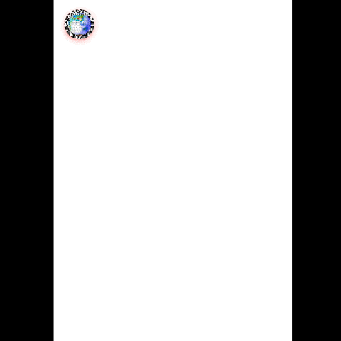

# Dash Discord


[](https://github.com/ambv/black)




```bash
pip install dash-discord
```

[](https://pepy.tech/project/dash-discord)

## Documentation

https://pip-install-python.com/pip/dash_discord

### Introduction

There are two components in this package `DiscordCrate` and `DiscordWidget`. Their purpose is to connect a dash application directly to a discord server.

`DiscordCrate` is a collapsable and expandable widget that allows users to interact with a Discord server.

`DiscordWidget` is a full screen always open widget that allows users to interact with a Discord server.

### DiscordWidget Props

```python
from dash import Dash, html
from dash_discord import DiscordWidget

layout=html.Div(DiscordWidget(
    id='widget',
    server='1246197743307980940',
    channel='1246197743781810332',
    username='Pip Install Python',
    avatar='',
    hight='100%',
    width='100%',
))
```

| Prop       | Description                                                                                |
|------------|--------------------------------------------------------------------------------------------|
| `server`   | Required String. Found in the discord server settings.                                     |
| `channel`  | Required String. Found right clicking the channel you want to connect with and copy the ID |
| `username` | Optional String. Initial username to show by default.                                      |
| `avatar`   | Optional String. URL of the users avatar to show by default.                               |
| `hight`    | Optional String. On load height of the component.                                          |
| `width`    | Optional String. On load width of the component.                                           |

### DiscordCrate

A `DiscordCrate` is a collapsable and expandable widget that allows users to interact with a Discord server. It can be used to display a Discord server in a Dash app.

```python
from dash import Dash, html
from dash_discord import DiscordCrate

layout=html.Div(DiscordCrate(
    id='crate',
    server='1246197743307980940',
    channel='1246197743781810332',
    username='Pip Install Python',
    avatar='https://avatars.githubusercontent.com/u/83238564',
    location=['top', 'left'],
    color='red',
    glyph=['https://geomapindex.com/media/blog_qr/2024/05/28/qr-http___dashgeomapindexcom_AihBuSf.gif', '75px'],
    notifications=True,
    indicator=True,
    timeout=5000,
    allChannelNotifications=True,
    embedNotificationTimeout=5000,
    defer=True,
))
```

| Prop                       | Description                                                                                                                                       |
|----------------------------|---------------------------------------------------------------------------------------------------------------------------------------------------|
| `server`                   | Required String. Found in the discord server settings.                                                                                            |
| `channel`                  | Required String. Found right clicking the channel you want to connect with and copy the ID                                                        |
| `username`                 | Optional String. Initial username to show by default.                                                                                             |
| `avatar`                   | Optional String. URL of the users avatar to show by default.                                                                                      |
| `location`                 | Optional List. Location of the crate on the screen.                                                                                                |
| `color`                    | Optional String. Color of the crate.                                                                                                               |
| `glyph`                    | Optional List. Image and size of the glyph.                                                                                                        |
| `notifications`            | Optional Boolean. Show notifications.                                                                                                              |
| `indicator`                | Optional Boolean. Show indicator.                                                                                                                  |
| `timeout`                  | Optional Integer. Time before the crate closes.                                                                                                   |
| `allChannelNotifications`  | Optional Boolean. Show notifications for all channels.                                                                                             |
| `embedNotificationTimeout` | Optional Integer. Time before the notification closes.                                                                                             |
| `defer`                    | Optional Boolean. Defer loading of the crate.                                                                                                      |

[](https://pip-install-python.com/pip/dash_discord)


